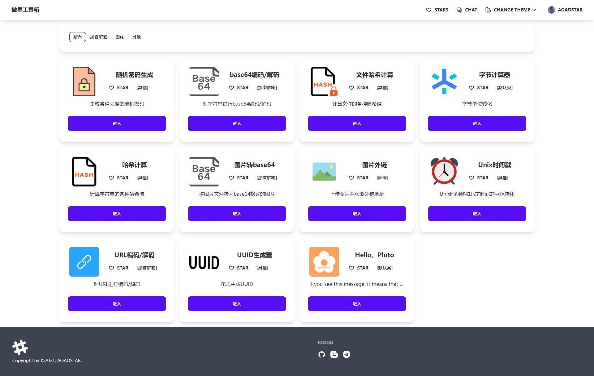
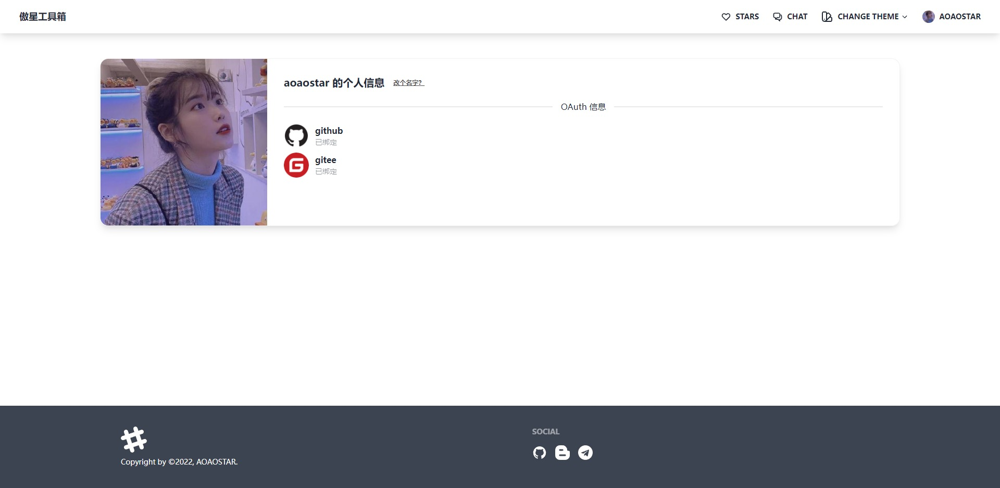
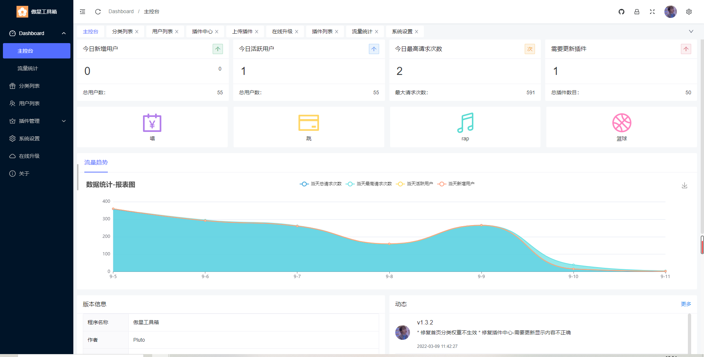
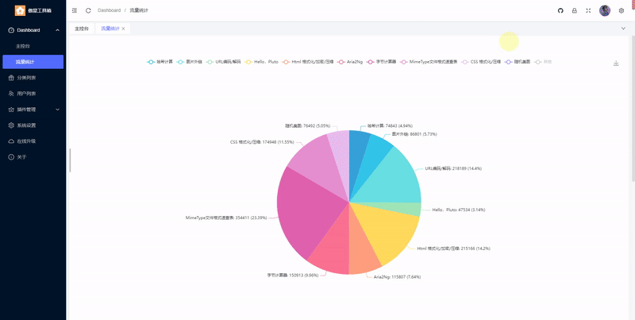
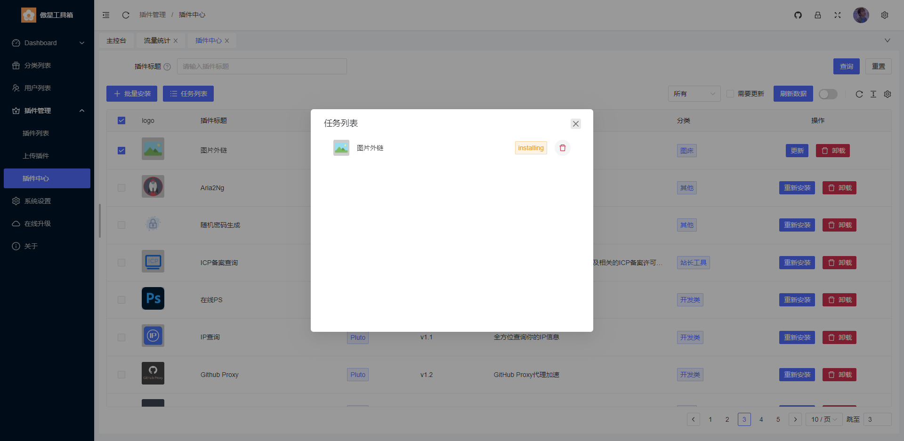

### 🎉 What's this？

这是一款`在线工具箱`程序，您可以通过安装扩展增强她的功能  
通过插件模板的功能，您也可以把她当做网页导航来使用~    
觉得该项目不错的可以给个`Star`~

### 😺 演示地址

* <https://tool.aoaostar.com>

### 🍹 演示图

点击展开

<table style="width:100%;text-align: center">
<tr>
<td>
    
    
首页

</td>
<td>
    
    
首页

</td>
</tr>
<tr>
<td>
    
    
用户中心

</td>
<td>
    
    
后台首页

</td>
</tr>
<tr>
<td width="50%">
    
    
流量统计

</td>
<td width="50%">
    
    
插件中心

</td>
</tr>
</table>

## 🎑 说明

> 严禁用于非法用途

### 📄 文档

* [宝塔面板 部署](docs/Baota_Deploy.md)
* [Docker 部署](docs/Docker_Deploy.md)
* [插件编写](docs/Plugin.md)
* [Github Oauth 配置](docs/Github_Oauth.md)
* [Plugin Template 使用](docs/Plugin_Template.md)
* [Plugin Permission 使用](docs/Plugin_Permission.md)

#### 演示搭建视频

* <https://www.bilibili.com/video/BV12g411z7KL>

### 😊 Donate

#### 🍓 鸣谢

* [thinkphp](https://github.com/top-think/framework)
* [Vue.js](https://github.com/vuejs/vue)
* [daisyUI](https://github.com/saadeghi/daisyui)
* [tailwindcss](https://github.com/tailwindlabs/tailwindcss)
* [Naive Ui](https://github.com/tusen-ai/naive-ui)
* [Naive Ui Admin](https://github.com/jekip/naive-ui-admin)
