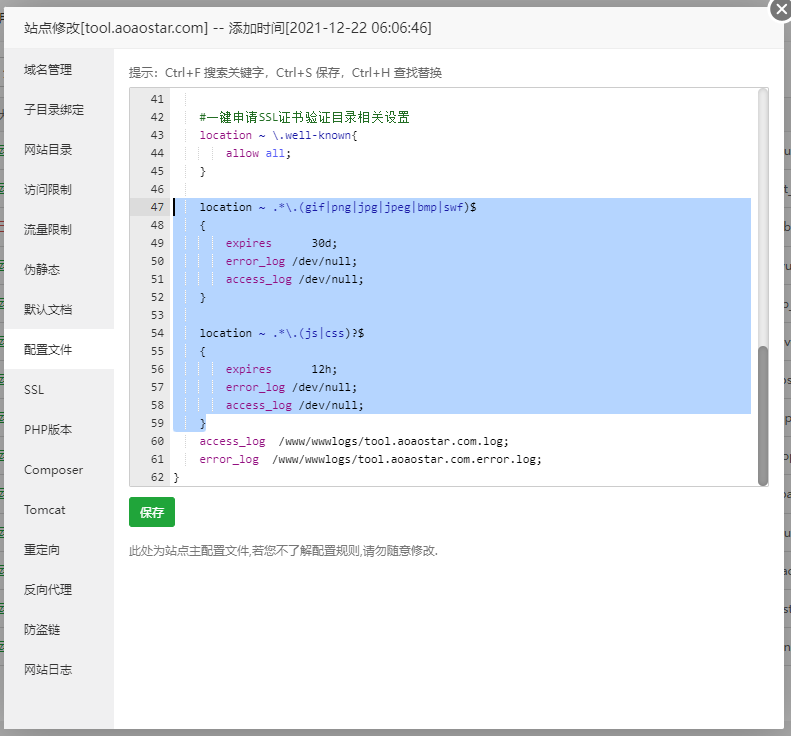

### 🎉 What's this？
这是一款`在线工具箱`程序，您可以通过安装扩展增强她的功能  
通过插件模板的功能，您也可以把她当做网页导航来使用~    
觉得该项目不错的可以给个`Star`~

### 😺 演示地址

* <https://tool.aoaostar.com>


### 🍹 演示图


## 🎑 说明
> 严禁用于非法用途  

### 😺 文档
[插件编写](docs/Plugin.md)  
[Github Oauth 配置](docs/Github_Oauth.md)     
[Plugin Template 使用](docs/Plugin_Template.md)      
[Plugin Permission 使用](docs/Plugin_Permission.md)      

### 🎊 环境要求

* `PHP` >= 7.2.5
* `MySQL` >= 5.7
* `fileinfo`扩展
* 使用`Redis`缓存需安装`Redis`扩展
* 去除禁用函数`proc_open`、`putenv`、`shell_exec`、`proc_get_status`(必须是命令行的PHP版本，你装了多个PHP版本，命令行版本的PHP和你的网站配置的PHP可能不是同一个)

### 🚠 部署

* 下载`Release`代码
* 设置运行目录为`public`
* 关闭防跨站（`open_basedir`）
* 设置伪静态
* 去除静态文件代理
    + 打开`nginx`配置
    + 删除图中选中的内容


* 安装依赖
    > `full`包，已安装依赖，无需重复安装
    + 配置阿里镜像源
    ```
    composer config -g repo.packagist composer https://mirrors.aliyun.com/composer/
    ```
    + 升级compose
    ```
    composer self-update
    ```
    + 安装依赖
    ```
    composer install --no-dev
    ```
* 设置目录权限
    + 一般是默认允许的（如有无法上传、无法打开页面或其他未知问题可以设置一下目录权限）
    + `Apache`的所属组为`www-data`，那么就请修改`www`为`www-data`
    
    ```shell script
    chmod -R 755 *
    chown -R www:www *
    ```
* 打开`你的域名/install`

#### 🍰 伪静态

* Nginx
```
location / {
	if (!-e $request_filename){
		rewrite  ^(.*)$  /index.php?s=$1  last;   break;
	}
}
```
* Apache
```
<IfModule mod_rewrite.c>
  Options +FollowSymlinks -Multiviews
  RewriteEngine On
  RewriteCond %{REQUEST_FILENAME} !-d
  RewriteCond %{REQUEST_FILENAME} !-f
  RewriteRule ^(.*)$ index.php/$1 [QSA,PT,L]
</IfModule>
```

### 😊 donate


#### 🍓 鸣谢

* thinkphp
* vuejs
* daisyui
* tailwindcss
* naive UI
* naive UI admin
