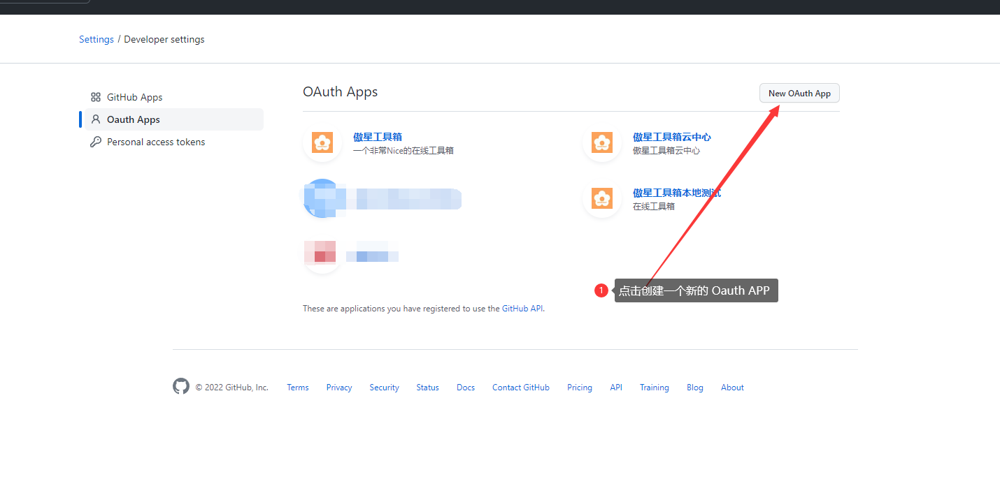
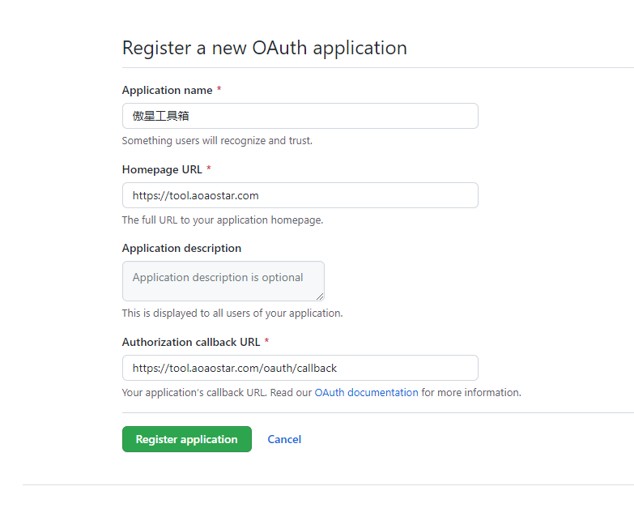
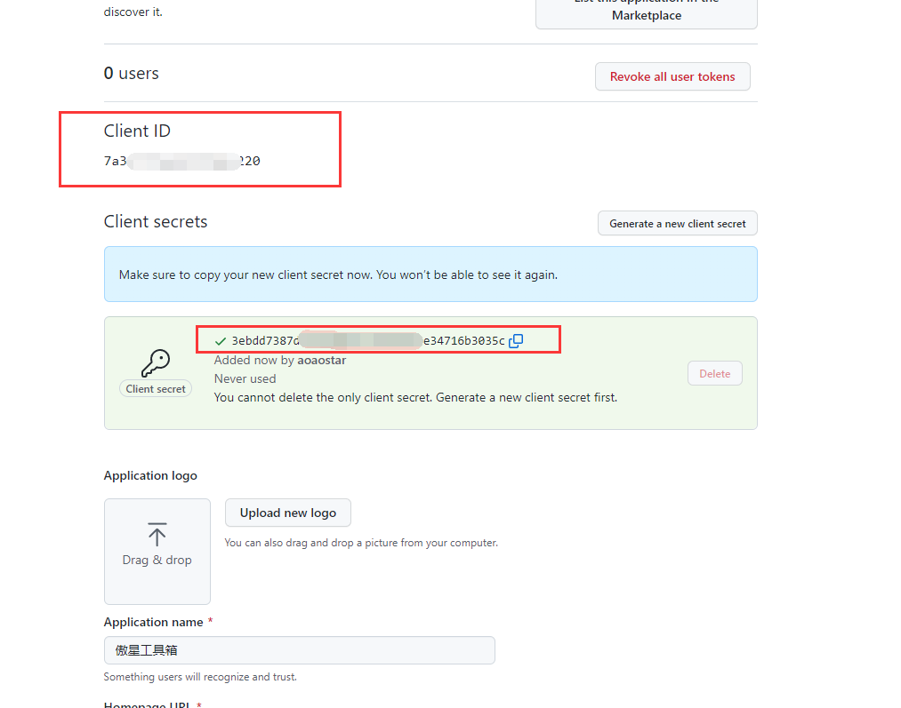

## Github Oauth 配置
* 打开Github，并且登录你的github账号
* 打开：https://github.com/settings/developers

### 创建一个Oauth APP

#### 填写APP信息

#### 获取`Client ID`和`Client secrets`

#### 最后在安装界面填入刚刚得到的的`Client ID`和`Client secrets`即可完成`Oauth`配置

## Gitee Oauth 配置

> 操作方法类似，不再详解