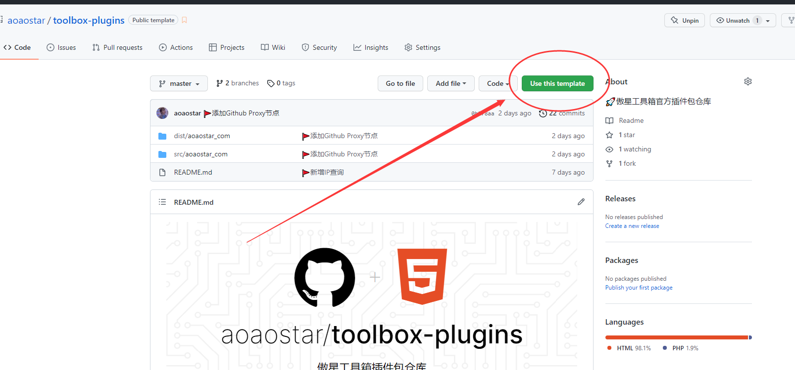
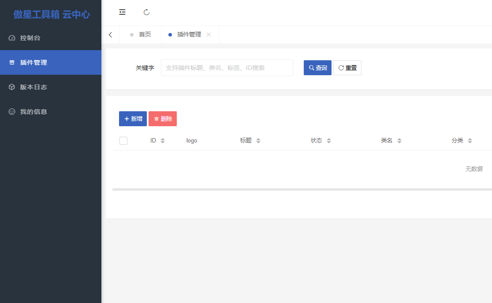
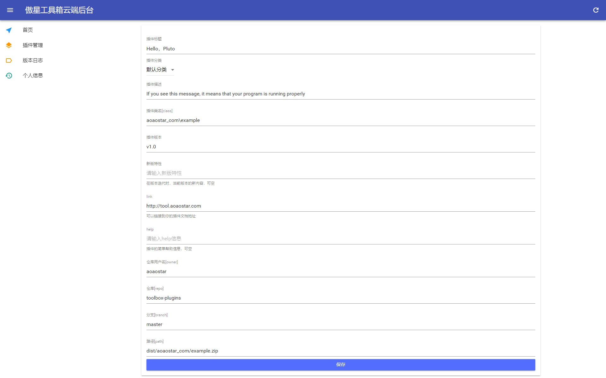
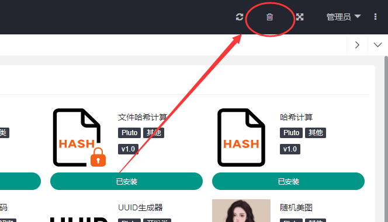

## 插件编写

### 插件项目文件规范
```
└─plugin
   └─aoaostar_com       # 顶级域名 .用_代替
      └─example         # 插件名
         └─static       # 静态文件目录
        App.php         # API
        index.html      # 首页
        Install.php     # 安装、卸载时会执行方法
        logo.png        # logo 图片
```

### Install.php
```php
<?php

namespace plugin\aoaostar_com\example;


use app\model\Plugin;

class Install implements \plugin\Install
{
    # 安装时运行方法
    public function Install(Plugin $model)
    {
        # 标题
        $model->title = "Hello，Pluto";
        # 类名、无需修改
        $model->class = plugin_current_class_get(__NAMESPACE__);
        # 路由、即 example
        $model->alias = base_space_name(__NAMESPACE__);
        # 描述
        $model->desc = 'If you see this message, it means that your program is running properly.';
        # 版本号
        $model->version = 'v1.0';
    }
    # 卸载时运行方法
    public function UnInstall(Plugin $model)
    {

    }
}
```

### App.php

```php
<?php

namespace plugin\aoaostar_com\example;

use plugin\Drive;

class App implements Drive
{
    # 访问/api/example
    public function Index()
    {
        return msg("ok", __METHOD__);
    }

    # 访问/api/example/upload
    public function Upload()
    {
        return msg("ok", __METHOD__);
    }
}
```
### 编写完毕
到这一步插件就编写完毕了，是不是很简单呢？

## 上传到插件中心

### 打开插件仓库  
<https://github.com/aoaostar/toolbox-plugins>

### 复刻仓库


### 打包文件
```
Usage:
  plugin:package <space>

Arguments:
  space                 插件域，例如：aoaostar_com
```
* 打开命令行
* 进入程序根目录（`cd`命令）
* 运行命令
```
php think plugin:package aoaostar_com
```
命令运行后将打包`plugin/aoaostar_com`下的所有插件    
在`plugin/out/`目录下生成`aoaostar_com/*.zip`文件

### 储存
> 旧的多余的插件包可以删除掉了    
> 新的文件按照下方文件结构放置即可
```
├─dist
│  └─aoaostar_com
│          example.zip
└─src
    └─aoaostar_com
        └─example
                App.php
                index.html
                Install.php
                logo.png
```
然后`push`到`github`仓库即可

### 发布
* 打开傲星工具箱云平台，并且登录    
<https://tool-cloud.aoaostar.com/>


* 添加插件  



> 添加完毕后即可在`插件管理`/`工具箱后台` - `插件中心`看到你刚才添加的插件了   
>请严格按照上方目录 # 储存 规定的文件结构储存文件！    
>否则将导致无法显示logo或者无法在线安装！
### 小贴士
* `工具箱后台` - `插件中心`看不到我发布的插件?
    * 刷新缓存即可    
    * 