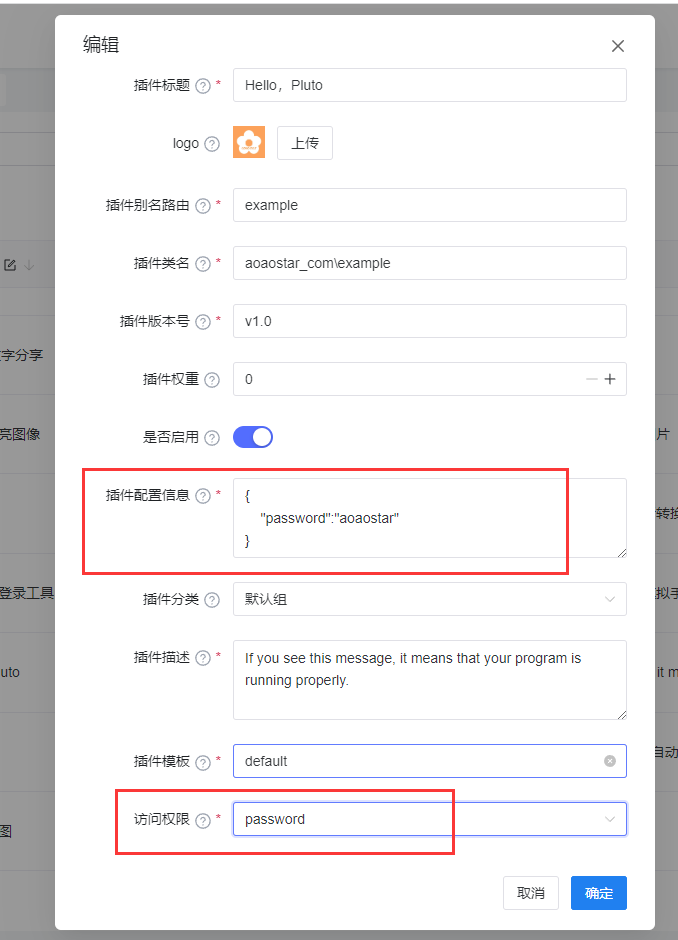
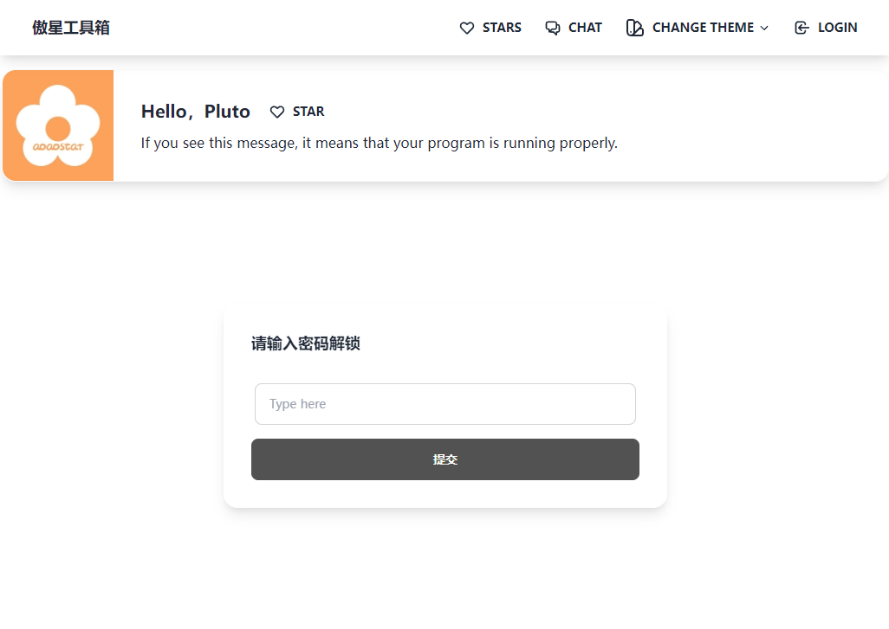

## Plugin Permission 使用
### 介绍
* admin
   - 管理员方可访问，管理员可以访问所有
* login
   - 登录后方可访问
* password
   - 密码认证后方可访问
* visitor
   - 所有人
   
> 简要介绍一下`password`密码访问的使用

### 编辑插件

### 在插件配置信息填入下方`JSON`数据
```json
{
    "password":"aoaostar"
}
```


### 成功演示


## 常见问题

* 为什么设置了无效？
    - 清理缓存后即可生效
