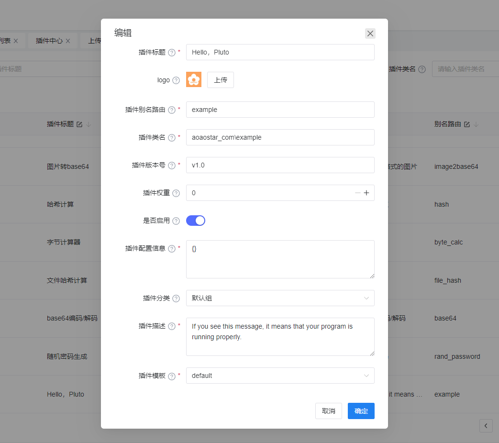
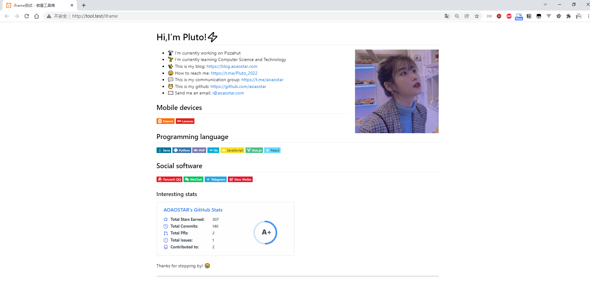
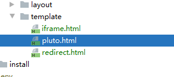
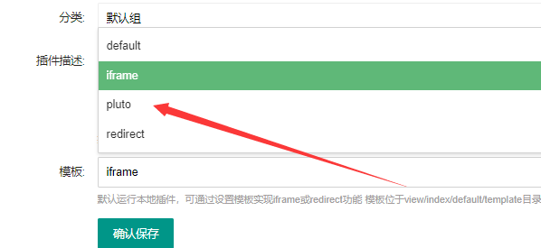

## Plugin Template 使用
### 添加插件


### 在插件配置信息填入下方`JSON`数据
```json
{
    "url":"https://www.aoaostar.com"
}
```
### 成功演示

#### `redirect`亦是如此

## 添加新模板
### 在`view/index/default/template`添加`pluto.html`


### 添加成功之后，即可在后台看到新增的模板

